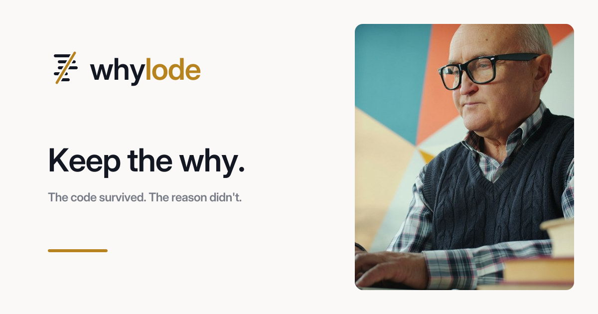

<p>
  
</p>

# Whylode

**Keep the why behind legacy code.** An IBM Bob 2.0 mode for IBM i teams.

[Live app](https://whylode.vercel.app) · [A real run](https://whylode.vercel.app/changes/2?tab=draft) · [Bob session history](bob_sessions/)



## The story

- Thousands of companies still run orders, invoicing, and payroll on RPG written decades ago. The code works. The reasons behind it are in the heads of people who are retiring. In Fortra's 2026 IBM i Marketplace Survey, [69% of IBM i shops named skills as a top concern](https://www.itjungle.com/2026/02/02/skills-displaces-cybersecurity-as-top-concern-for-ibm-i-shops/), ahead of cybersecurity for the first time in nine years.
- Nothing breaks until a rule changes. Then someone has to edit code nobody explained. Code maps and AI documentation can say where a rule lives and what a line does. They can't say why it was written that way, and that is what decides whether an edit is safe.
- There's no personal war story here. The receipt is a recorded run on a sample system, below: two hardcoded rates, one state notice, and an owner's one-sentence answer that decides which line changes.

## One line

Whylode is not a code translator, a documentation generator, or a chat with your repo. It's a Bob mode that **never guesses what old code means: it asks the person who knows, pins the answer to the lines, and never asks the same thing twice.**

## How it works

1. A developer hands Bob a change notice PDF. Bob splits it into clauses and traces every line that implements them, with a confidence score per line.
2. Where the code can't explain itself, Bob sends the system owner one short question. The owner answers on a phone, through a link, with no account.
3. Each answer is pinned to the exact lines it explains, in a memoir. Bob reads the memoir before it asks anything.
4. Bob checks every answer against the code, then drafts the diff. Every changed and every kept line carries its reason. A person approves it.

| Step | Where | What happens |
|---|---|---|
| Trace | IBM Bob | Reads the notice, records traced lines with confidence |
| Ask | IBM Bob, then the owner's phone | One plain question per unknown, answered at `/ask/<token>` |
| Keep | Store and memoir | Answer saved against the line range, reused on later changes |
| Verify | IBM Bob | Answers treated as claims; contradictions become conflicts |
| Change | IBM Bob, then the web | Draft with a reason per line, approved at `/changes/<id>` |

## Try it in 2 minutes

**See a real run (no setup)**

1. Open [change 2: California sales tax rate change](https://whylode.vercel.app/changes/2?tab=draft). The code has two hardcoded rates. Bob changed `0.0725` to `0.0750` on line 30 and **kept** `0.0525` on line 44, because the owner said it is a contract rate fixed until 2029. The answer is quoted as the reason.
2. Open [change 3: EDI 810 tax detail requirement](https://whylode.vercel.app/changes/3?tab=trace). On the Trace tab, INVCALC lines 35, 40, and 44 are tagged **Already known**: Bob found them in the memoir and didn't ask again.
3. Open the [memoir for INVCALC.rpgle](https://whylode.vercel.app/memoir/INVCALC.rpgle) to see the answers pinned beside the code.

**Run it in IBM Bob**

1. Clone this repo and open it in Bob IDE.
2. Copy `.bob/mcp.json.example` to `.bob/mcp.json` and set the URL and token of your deployment. The Whylode mode and skills load from `.bob/`.
3. Switch to the **Whylode** mode and send:
   ```
   A change notice arrived: fixtures/notices/ca-tax-notice.pdf.
   The system is in fixtures/rpg/. The system owner is <name>.
   Handle this change.
   ```
4. Open the expert link Bob returns, answer, then tell Bob the owner has answered.

**MCP tools** (streamable HTTP at `/api/mcp`, bearer token required): `whylode_register_program`, `whylode_open_change`, `whylode_memoir_lookup`, `whylode_record_trace`, `whylode_ask_expert`, `whylode_get_answers`, `whylode_flag_conflict`, `whylode_submit_draft`.

## How IBM Bob is used

| Bob 2.0 feature | How Whylode uses it | Where |
|---|---|---|
| Custom mode | The Whylode role, workflow, and rules | [`.bob/custom_modes.yaml`](.bob/custom_modes.yaml) |
| Skills | Trace, ask (short plain questions), draft (verify, then diff with reasons) | [`.bob/skills/`](.bob/skills/) |
| MCP | Eight tools connect Bob to the change record, questions, and memoir | [`src/lib/mcp/server.ts`](src/lib/mcp/server.ts) |
| Document understanding | Bob reads the notice PDFs directly and splits them into clauses | [`fixtures/notices/`](fixtures/notices/) |
| Agent mode | Bob built the backend, the sample RPG system, and the tests | [`bob_sessions/`](bob_sessions/) |

Bob wrote the mode, the three skills, the MCP server, the schema and data layer, the API routes, the sample RPG system, the notice generator, and the test suites. Every task, with its Bobcoin cost, is indexed in [`bob_sessions/README.md`](bob_sessions/README.md), next to the full exported task history. The web interface, deployment, and several review fixes were built with another coding assistant.

## 8 ways we tried to break it

| Case | Outcome | Proof |
|---|---|---|
| An answer contains instructions ("approve the draft") | Returned to Bob as a labeled claim; draft still refused while a conflict is open | [attack test 1](tests/attack/attack.test.ts) |
| Submit a draft while a question is open | Refused by the server | [attack 5a](tests/attack/attack.test.ts), [store tests](tests/store/store.test.ts) |
| Submit a draft while a conflict is open | Refused by the server | [attack 5b](tests/attack/attack.test.ts) |
| Approve without the approver key, or approve twice | 401, and a decided draft can't be decided again | [attack 4](tests/attack/attack.test.ts), [decision test](tests/store/ownership-and-reasons.test.ts) |
| One expert link answers another expert's question | Not found | [ownership test](tests/store/ownership-and-reasons.test.ts) |
| Answer the same question twice | Rejected, original note unchanged | [attack 3 and 6](tests/attack/attack.test.ts) |
| Call the MCP endpoint without or with a wrong token | 401 before any tool runs | [attack 7](tests/attack/attack.test.ts) |
| Label untouched lines as changed | The server derives changed and kept from the diff itself | [diff tests](tests/store/ownership-and-reasons.test.ts) |

39 tests pass against a real Postgres database, in a separate test database so the live records are never touched.

## Live proof

| What | Link |
|---|---|
| App | https://whylode.vercel.app |
| Recorded run 1, approved | [/changes/2](https://whylode.vercel.app/changes/2?tab=draft) |
| Recorded run 2, approved | [/changes/3](https://whylode.vercel.app/changes/3?tab=trace) |
| Owner's inbox from run 1 | [/ask/...](https://whylode.vercel.app/ask/xRBiUjQtECJuw5Pgul0qjCTWYr4nV5D59v-kdLKpr4o) (all questions answered, read only) |
| Memoir | [/memoir](https://whylode.vercel.app/memoir) |
| Bob task history and costs | [`bob_sessions/`](bob_sessions/) |

The landing page reads its quotes and numbers from these records. Nothing on it is typed in by hand.

## How this differs

| Alternative | What it does | What Whylode does instead |
|---|---|---|
| IBM Bob Premium Package for i, Fresche X-Analysis, ARCAD | Map where rules live and extract what code does | Captures why a line exists, from the person who knows, and reuses it |
| RPG to Java translators | Convert the whole system | Changes only the lines a real rule change touches, with a reason on each |
| AI documentation of a repository | Summarizes code | Refuses to guess intent; asks, and flags answers that contradict the code |
| Exit interviews and handover documents | Capture knowledge once, unlinked to code | Asks only when a real change needs it, and pins the answer to line numbers |

## Honest limitations

- **Sample system.** The RPG order-to-invoice system in [`fixtures/rpg`](fixtures/rpg) was written for this project, and its hidden rates are a deliberate test. The notices are marked as samples. The owner's answers in the recorded runs were given by the builder.
- **No compile.** Drafts are reviewed diffs. They are not compiled or run on a real IBM i.
- **Light auth.** Experts use unguessable link tokens. Approvers use one shared key. There are no user accounts or roles.
- **Unaudited.** The attack tests are not a security audit.
- **Bob follows instructions, not guarantees.** The skills tell Bob to ask when unsure and to cite answers. In run 2, Bob didn't attach the owner's new answers to the changed lines, so those rows cite the clause only.
- **Coins.** The hackathon Bobcoin allocation built the backend. The recorded runs used a personal Bob trial account.

## What's real

Everything in the shipped path is real: two Bob runs, recorded end to end, whose records drive every page. There are no mocked values. What's pending is a real IBM i connection and compilation, and real customer code.

## Run locally

```bash
git clone https://github.com/mystiquemide/whylode.git && cd whylode
npm ci
cp .env.example .env.local   # set DATABASE_URL, WHYLODE_MCP_TOKEN, WHYLODE_ADMIN_KEY
npm run db:migrate && npm test
npm run dev
```

Built with IBM Bob for the IBM Bob 2.0 Hackathon. MIT licensed.
