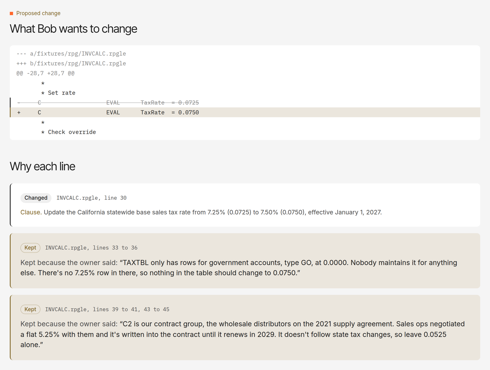

<p></p>

An IBM Bob 2.0 mode for legacy code maintenance. Before Bob changes a rule in old RPG code, it asks the owner about the lines it can't explain, and every line of the diff carries that reason.

[Live app](https://whylode.vercel.app) · [A recorded run](https://whylode.vercel.app/changes/2?tab=draft) · [IBM Bob task sessions](bob_sessions/) · MIT



## The problem

Workflow: application maintenance on IBM i.

Many companies still run invoicing, tax and payroll on RPG written decades ago. The reasons behind that code live in the heads of people who are retiring. In Fortra's 2026 IBM i Marketplace Survey, [69% of IBM i shops named skills as a top concern](https://www.itjungle.com/2026/02/02/skills-displaces-cybersecurity-as-top-concern-for-ibm-i-shops/), ahead of cybersecurity for the first time in nine years. When a rule changes, such as a new tax rate, a developer has to find every line that implements it and decide which ones to touch.

Code tools can show where a value lives, but not why it's there. On our sample system, the invoice program hardcodes two rates. One is the state rate. The other is a contract rate that must not change. Nothing in the code tells them apart, so a search-and-replace, or an AI agent working alone, can edit the wrong line. The cost shows up as wrong invoices, rework, and hours spent chasing the one person who remembers.

## The solution

Whylode turns Bob into a maintenance agent that asks instead of guessing.

1. The developer gives Bob the change notice PDF. Bob splits it into clauses and traces every line that implements each one, with a confidence score per line.
2. For lines the code can't explain, Bob sends the owner one plain question. The owner answers on a phone through a link, with no account.
3. Each answer is pinned to the exact lines in a memoir. Bob checks the memoir first, so nobody is asked the same thing twice.
4. Bob drafts the diff. Every changed and every kept line cites its clause or the owner's answer. A person approves it in the web app.

## Impact, on the recorded runs

Both runs were recorded end to end in Bob IDE on the sample system in [`fixtures/rpg`](fixtures/rpg), then approved.

| Change | Lines traced | Questions to the owner | Lines already known | Result |
|---|---|---|---|---|
| [California sales tax rate change](https://whylode.vercel.app/changes/2?tab=draft) | 14 | 2 | 0 | Changed only line 30 (`0.0725` to `0.0750`). Kept the `0.0525` contract rate, citing the owner. |
| [EDI 810 tax detail requirement](https://whylode.vercel.app/changes/3?tab=trace) | 24 | 2 | 3 | Reused 3 answered INVCALC lines from the memoir without asking again. |

- Errors: the contract rate, the line an unguided edit gets wrong, stayed untouched, with the reason written on it.
- Manual effort: the owner answered 2 short questions per change on a phone, instead of reviewing code.
- Rework: knowledge from change 2 was reused in change 3. The [memoir for INVCALC.rpgle](https://whylode.vercel.app/memoir/INVCALC.rpgle) shows the answers beside the code.

## How IBM Bob is used

| Bob 2.0 feature | Use in Whylode | Files |
|---|---|---|
| Agent mode | Bob built the backend: the mode, skills, MCP server, schema, data layer, API routes, sample RPG system, notice generator and tests | [`bob_sessions/`](bob_sessions/) |
| Document understanding | Bob reads the change notice PDFs directly and splits them into clauses | [`fixtures/notices`](fixtures/notices) |
| Custom mode | The Whylode role, order of work, and the rule to ask instead of guess | [`.bob/custom_modes.yaml`](.bob/custom_modes.yaml) |
| Skills | Trace, ask, and draft | [`.bob/skills`](.bob/skills) |
| MCP | 8 tools connect Bob to the change record, questions and memoir | [`src/lib/mcp/server.ts`](src/lib/mcp/server.ts) |

MCP tools, served over streamable HTTP at `/api/mcp` with a bearer token: `whylode_register_program`, `whylode_open_change`, `whylode_memoir_lookup`, `whylode_record_trace`, `whylode_ask_expert`, `whylode_get_answers`, `whylode_flag_conflict`, `whylode_submit_draft`.

Task session summary screenshots, the exported task history and each task's Bobcoin cost are in [`bob_sessions/`](bob_sessions/). The web interface and deployment were built with another coding assistant.

## Try it

Without setup, open [change 2](https://whylode.vercel.app/changes/2?tab=draft) and read "Why each line".

To run it in Bob:

```bash
git clone https://github.com/mystiquemide/whylode.git && cd whylode
npm ci
cp .env.example .env.local   # DATABASE_URL, WHYLODE_MCP_TOKEN, WHYLODE_ADMIN_KEY, WHYLODE_BASE_URL
npm run db:migrate && npm test
npm run dev
```

Copy `.bob/mcp.json.example` to `.bob/mcp.json`, and set your `/api/mcp` URL and `WHYLODE_MCP_TOKEN`. Open the repo in Bob IDE, switch to the Whylode mode, and send:

```
A change notice arrived: fixtures/notices/ca-tax-notice.pdf.
The system is in fixtures/rpg/. The system owner is <name>. Handle this change.
```

Architecture: one Next.js app on Vercel serves the MCP endpoint, the API and the pages, backed by Postgres on Neon. There are 39 tests, run against a real test database. See [`docs/ARCHITECTURE.md`](docs/ARCHITECTURE.md).

## Limits

- The RPG system was written for this project. The notices are samples, and the owner's answers in the recorded runs were given by the builder.
- Drafts are reviewed diffs. They aren't compiled or run on a real IBM i.
- Owners use link tokens, and approvers use one shared key. There are no user accounts, and nothing here has been audited.

## License

[MIT](LICENSE)
